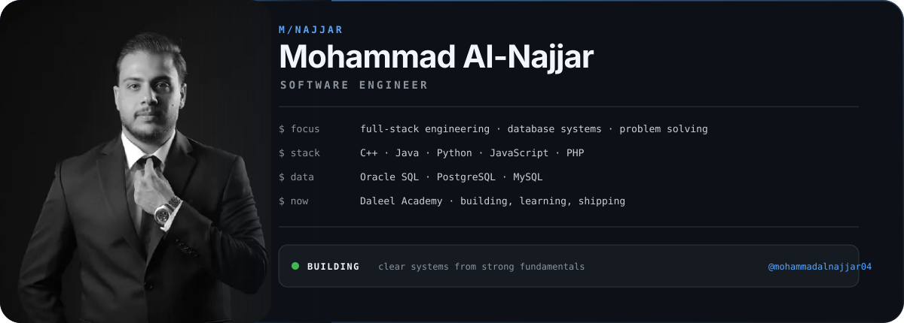

<picture>
  <source media="(prefers-color-scheme: dark)" srcset="assets/profile-dark.svg">
  <source media="(prefers-color-scheme: light)" srcset="assets/profile-light.svg">
  
</picture>

I build software with a bias for **clear systems, strong fundamentals, and work that can be inspected**. Computer Science graduate currently sharpening full-stack engineering, databases, and algorithmic problem solving through real projects.

## Selected Work

**01 / [Agricultural Supply Chain](https://github.com/mohammadalnajjar04/agricultural-supply-chain)**  
Full-stack platform for coordinating farmers, transporters, and stores, with role-based workflows and AI-assisted decision support.  
`PHP` · `MySQL` · `Python`

**02 / [CSES Solutions](https://github.com/mohammadalnajjar04/cses-solutions)**  
A growing collection of clean C++ solutions focused on algorithms, complexity, and disciplined problem solving.  
`C++` · `Algorithms` · `Data Structures`

**03 / [Oracle SQL Journey](https://github.com/mohammadalnajjar04/Oracle-SQL-Journey)**  
Structured hands-on practice in Oracle SQL, from core querying concepts to database-focused exercises and notes.  
`Oracle SQL` · `Database Fundamentals`

## Experience

**Full-Stack Developer Trainee** · Daleel Academy · `2026 — Present`  
Building full-stack applications and strengthening modern software engineering practices.

**Field Training Intern** · Irbid District Electricity Company (IDECO) · `2026`  
Worked on an Android customer-service application in an enterprise training environment.

## Connect

[LinkedIn](https://www.linkedin.com/in/mohammad-alnajjar04) · [Portfolio](https://mohammadalnajjar04.github.io/portfolio/) · [GitHub](https://github.com/mohammadalnajjar04) · [Email](mailto:alnajjarmohammad00@gmail.com)
